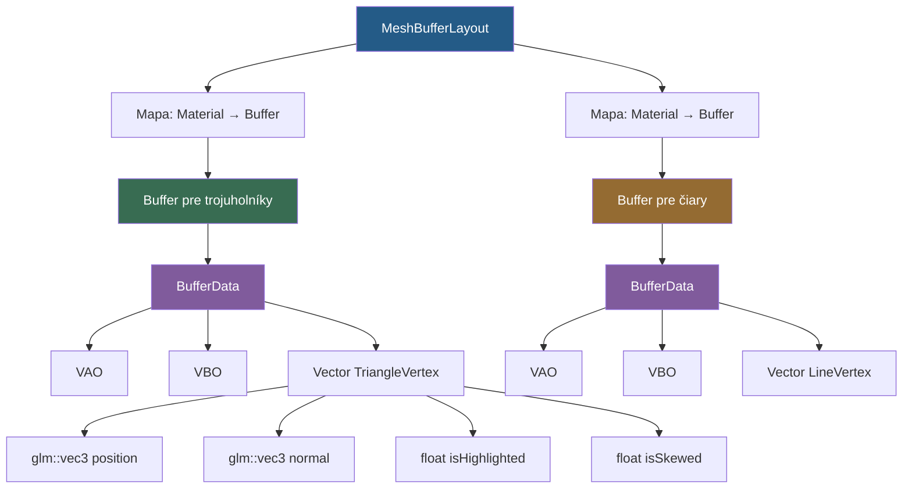

```mermaid
flowchart TB
    MBL["MeshBufferLayout"]

    MBL --> TM["Mapa: Material → Buffer"]
    MBL --> LM["Mapa: Material → Buffer"]

    TM --> TBUF["Buffer pre trojuholníky"]
    LM --> LBUF["Buffer pre čiary"]

    TBUF --> TD["BufferData"]
    LBUF --> LD["BufferData"]

    TD --> TVAO["VAO"]
    TD --> TVBO["VBO"]
    TD --> TV["Vector TriangleVertex"]

    LD --> LVAO["VAO"]
    LD --> LVBO["VBO"]
    LD --> LV["Vector LineVertex"]

    TV --> TPOS["glm::vec3 position"]
    TV --> TNORM["glm::vec3 normal"]
    TV --> TH["float isHighlighted"]
    TV --> TS["float isSkewed"]

    style MBL fill:#245b87,color:#fff
    style TBUF fill:#386c52,color:#fff
    style LBUF fill:#946b32,color:#fff
    style TD fill:#805b9c,color:#fff
    style LD fill:#805b9c,color:#fff
```