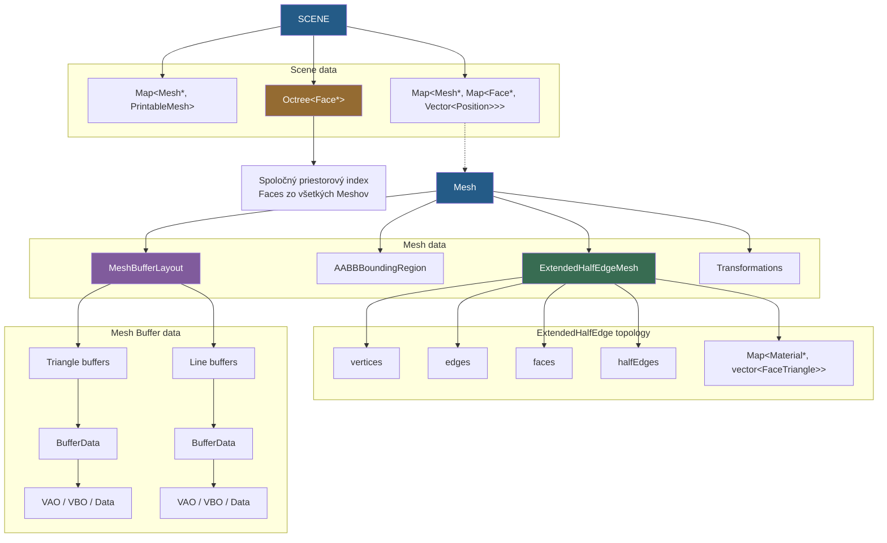

```mermaid
flowchart TB
    SCENE["SCENE"]

    subgraph SCENE_DATA["Scene data"]
        MAP1["Map&lt;Mesh*, PrintableMesh&gt;"]
        OCTREE["Octree&lt;Face*&gt;"]
        MAP2["Map&lt;Mesh*, Map&lt;Face*, Vector&lt;Position&gt;&gt;&gt;"]
    end

    SCENE --> MAP1
    SCENE --> OCTREE
    SCENE --> MAP2

    OCTREE --> OCTINFO["Spoločný priestorový index<br/>Faces zo všetkých Meshov"]

    MAP2 -.-> MESH

    MESH["Mesh"]

    subgraph MESH_DATA["Mesh data"]
        HEM["ExtendedHalfEdgeMesh"]
        AABB["AABBBoundingRegion"]
        MBL["MeshBufferLayout"]
        TRANS["Transformations"]
    end

    MESH --> HEM
    MESH --> AABB
    MESH --> MBL
    MESH --> TRANS

    subgraph TOPOLOGY["ExtendedHalfEdge topology"]
        HEM --> V["vertices"]
        HEM --> E["edges"]
        HEM --> F["faces"]
        HEM --> HE["halfEdges"]
        HEM --> TMAP["Map&lt;Material*, vector&ltFaceTriangle&gt&gt;"]


    end

    subgraph RENDERING["Mesh Buffer data"]
        MBL --> TM["Triangle buffers"]
        MBL --> LM["Line buffers"]
        TM --> TDATA["BufferData"]
        LM --> LDATA["BufferData"]
        TDATA --> VAO1["VAO / VBO / Data"]
        LDATA --> VAO2["VAO / VBO / Data"]
    end

    style SCENE fill:#245b87,color:#fff
    style MESH fill:#245b87,color:#fff
    style HEM fill:#386c52,color:#fff
    style MBL fill:#805b9c,color:#fff
    style OCTREE fill:#946b32,color:#fff
```
