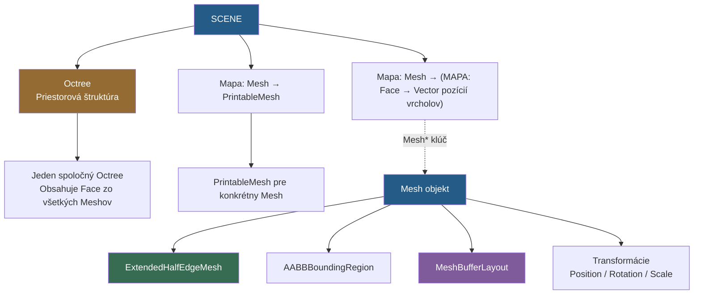

```mermaid
flowchart TB
    SCENE["SCENE"]

    SCENE --> MAP1["Mapa: Mesh → PrintableMesh"]
    SCENE --> OCTREE["Octree<br/>Priestorová štruktúra"]
    SCENE --> MAP2["Mapa: Mesh → (MAPA: Face → Vector pozícií vrcholov)"]

    OCTREE --> OCT["Jeden spoločný Octree<br/>Obsahuje Face zo všetkých Meshov"]

    MAP1 --> PM["PrintableMesh pre konkrétny Mesh"]

    MAP2 -. "Mesh* klúč" .-> MESH["Mesh objekt"]

    MESH --> HEM["ExtendedHalfEdgeMesh"]
    MESH --> AABB["AABBBoundingRegion"]
    MESH --> MBL["MeshBufferLayout"]
    MESH --> TRANS["Transformácie<br/>Position / Rotation / Scale"]

    style SCENE fill:#245b87,color:#fff
    style MESH fill:#245b87,color:#fff
    style HEM fill:#386c52,color:#fff
    style MBL fill:#805b9c,color:#fff
    style OCTREE fill:#946b32,color:#fff

    
```