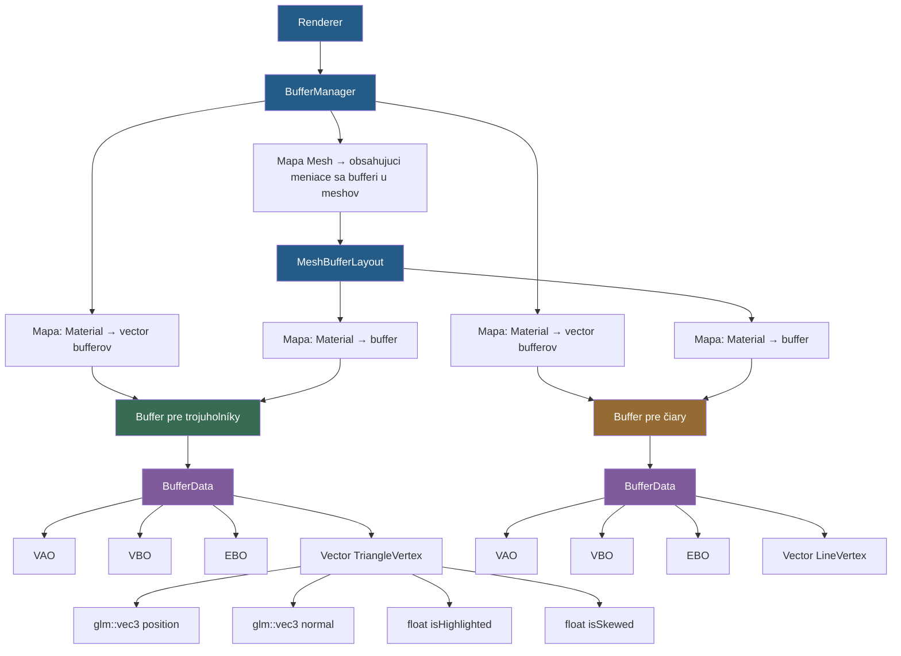

```mermaid
flowchart TB

    Renderer --> BufferManager

    BufferManager --> TM["Mapa: Material → vector bufferov"]
    BufferManager --> LM["Mapa: Material → vector bufferov"]
    BufferManager --> MeshBMAP["Mapa Mesh → obsahujuci meniace sa bufferi u meshov"]

    MeshBMAP --> MBL["MeshBufferLayout"]
    MBL --> TM2["Mapa: Material → buffer"]
    MBL --> LM2["Mapa: Material → buffer"]

    TM --> TBUF["Buffer pre trojuholníky"]
    TM2 --> TBUF
    LM --> LBUF["Buffer pre čiary"]
    LM2 --> LBUF

    TBUF --> TD["BufferData"]
    LBUF --> LD["BufferData"]

    TD --> TVAO["VAO"]
    TD --> TVBO["VBO"]
    TD --> TEBO["EBO"]
    TD --> TV["Vector TriangleVertex"]

    LD --> LVAO["VAO"]
    LD --> LVBO["VBO"]
    LD --> LEBO["EBO"]
    LD --> LV["Vector LineVertex"]

    TV --> TPOS["glm::vec3 position"]
    TV --> TNORM["glm::vec3 normal"]
    TV --> TH["float isHighlighted"]
    TV --> TS["float isSkewed"]

    style Renderer fill:#245b87,color:#fff
    style MBL fill:#245b87,color:#fff
    style BufferManager fill:#245b87,color:#fff
    style TBUF fill:#386c52,color:#fff
    style LBUF fill:#946b32,color:#fff
    style TD fill:#805b9c,color:#fff
    style LD fill:#805b9c,color:#fff
```