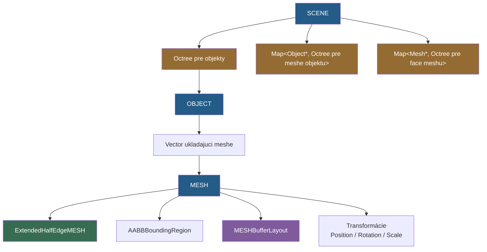

```mermaid
flowchart TB
    SCENE

    SCENE --> OCTREEOBJ["Octree pre objekty"] --> OBJECT
    SCENE --> OCTREEMESH["Map&lt;Object*, Octree pre meshe objektu&gt"]
    SCENE --> OCTREEFACE["Map&lt;Mesh*, Octree pre face meshu&gt"]

    OBJECT --> VECMESH["Vector ukladajuci meshe"] --> MESH

    MESH--> HEM["ExtendedHalfEdgeMESH"]
    MESH --> AABB["AABBBoundingRegion"]
    MESH --> MBL["MESHBufferLayout"]
    MESH --> TRANS["Transformácie<br/>Position / Rotation / Scale"]

    style SCENE fill:#245b87,color:#fff
    style MESH fill:#245b87,color:#fff
    style OBJECT fill:#245b87,color:#fff
    style HEM fill:#386c52,color:#fff
    style MBL fill:#805b9c,color:#fff
    style OCTREEOBJ fill:#946b32,color:#fff
    style OCTREEMESH fill:#946b32,color:#fff
    style OCTREEFACE fill:#946b32,color:#fff    
```